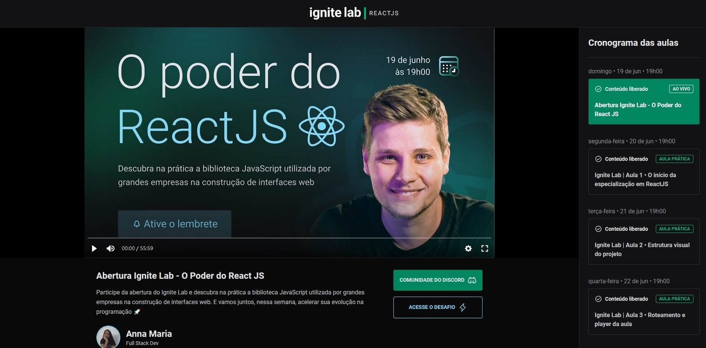

  

## ✨ Technologies

This project was developed with the following technologies:

- TypeScript
- React
- GraphiQL
- TailwindCSS
- React-Router-Dom
- Date Fns

## 💻 Project

Project created at Rocketseat's Ignite Lab event, project is a wind platform capable of listing video classes with specific teachers. 

## 🚀 Deploy

- Clone the repository
- Install dependencies with `npm install`
- Start the server with `npm run dev`

You can now access [`localhost:3000`](http://localhost:3000) from your browser.
